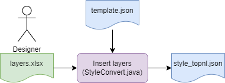
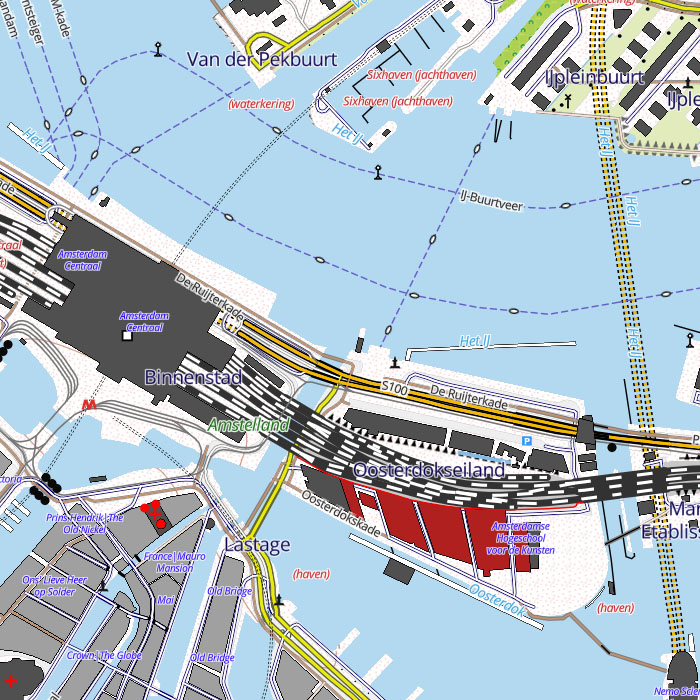

# The PDOK BRT TopNL Styling Project
## Introduction
One of the challenges of serving PDOK BRT vector maps is to create a suitable styling. For this, we wanted to create a style that matches the PDOK BRT TopRaster maps as close as possible.


Most of the items could be implemented using MapBox styling, however a few items had to be modified.

An advantage is that the vector maps contain more information than is shown in the raster maps, so we can add these as new features like bunkers and viewpoints. Another advantage of vector maps of course is that we can zoom in without the map becoming pixelated. 

## Workflow
To facilitate work, following workflow was adopted:


Basically we worked from the Excel file ```layers.xslx```. Each line represents a layer. Using StyleConvert.java the layers were inserted into a template, resulting in the style file ```style_topnl.json```.

The Excel file uses a number of rendering parameters (a subset, not all) which we can use to control the rendering. Each line corresponds with one layer. So it is easy to copy layers and adapt them.

The ```Check``` column defines a coordinate at which an example of the layer is shown. It can be used for testing.

## Dynamic styling
For raster maps like TopNL Raster rendering is static: styling is done once for the most detailed zoomlevel and static images are generated. Zooming means enalarging the image, zooming out means reducing the image. Zooming out enough means features can no longer be observed because they become to small to see.
Styling a vector map on the other hand is dynamic, which means features can be shown differently at different zoomlevels. Problems that arise here is that 'cluttering' can occur when zooming out. For this reason features should be omitted at less detailed zoomlevels.

Folling guidlines were applied:
* We use different scale TopNL maps for different zoomlevels: Top10NL, Top50NL, Top100NL, Top250NL, Top500NL and Top1000NL
* We ommit features when zooming out

## Layers
The style file is a JSON file that contains information about how a vector map is rendered. Refer to the [Mapbox Style Specification](https://docs.mapbox.com/style-spec/guides/) for details. Next shows our template file containing just one layer that draws the background color.

```
{
  "version": 8,
  "name": "PDOK BRT TopNL",
  "glyphs": "{fontstack}/{range}.pbf",
  "sources": 
  {
    "brt_topnl": 
    {
      "type": "vector",
      "url": "mbtiles://{PDOK BRT TopNL}"
    }
  },
  "sprite": "{styleJsonFolder}/sprites/sprites",
  "layers": 
  [
    {
      "id": "background",
      "type": "background",
      "paint": 
      {
        "background-color": "#000000"
      }
    }
  ]
}
```

The ```sources``` section defines the map data, ```glyphs``` the font files, ```sprite``` the graphical symbol location and layer the rules or ```layers``` defining the rendering of features.

The layer definition is what defines the rendering of the map. An important rule is that layers are rendered in the order in which they are defined. Hence the order is the 'z order'. A layer later in the file will overlap a layer earlier in the file.

As described in the [readme](readme.md), we use various PDOK BRT TopNL maps at various zoomlevels. This means, for each map/zoomlevel selection we have to define a layer that controls the rendering of a particular feature. Subsequent maps use slightly different attribute names. For example the top10nl map uses no underscores in the the attribute names like ```typeweg``` whereas the other maps use underscores, like ```type_weg```. Attribute values can also differ. For example in top10nl we have for forrests ```typelandgebruik``` 'bos: loofbos', 'bos: naaldbos', 'bos: gemengd bos' and 'bos: griend', whereas in top250nl we only have ```type_landgebruik``` 'bos'.


## Examples





## Known issues/deviations
### Extras
* Bunkers (```typeinrichtingselement``` 'bunker') are shown
* Viewpoints (```typeinrichtingselement``` 'uitzichtpunt') are shown
* Wrecks (```typeinrichtingselement``` 'zichtbaar wrak') are shown
* ```typeinrichtingselement``` 'paalwerk' is shown as 'strekdam' but dashed, small dashes
* Water with ```functie``` 'vloeiveld' has a dark blue outline color, like 'waterzuivering' has a red outline color
* Roads and runways with ```status``` 'buiten gebruik' have a dashed red casing, long dashes ('in uitvoering' are black long dashes). For example airport
* Also for the ```typeinrichtingselement```'kilometerpaal' (road) the value is shown, like for 'kilometerpaal spoorweg' and 'kilometerpaal water'

### Deviations
* We don't have roads with separate lanes on higher scales ('gescheiden rijbanen'). Zooming in to scale 1:10.000 shows lanes seperately.
* Culverts ('duikers') cannot be rendered, since MapBox does not allow symbol placement at the end of a line. Therefore rendered as darkblue line.
* ```typelandgebruik``` 'Overig' is white with red dots
* ```typelandgebruik``` 'Spoorbaanlichaam' is grey i.s.o. white
* Roads in tunnels are drawn dashed, including the interior; on the legend only outline are dashed, no interior is drawn
* Aquaducts are shown conform the legend: 

### Issues
* Some attributes like ```typegebouw``` can have more values that are concatenated in one string, like 'stationsgebouw|toren' or 'kasteel|toren'. Unfortunately in Mapbox you cannot filter on _parts of_ an attribute, like ```LIKE '%toren%'``` if you specifially look for 'toren'. Therefore if you want to filter, you have take into account _all occuring combinations_ of attribute values that incorporate the value you are looking for. Unfortunately, these combinations can change in subsequent versions of the PDOK TopNl map. This makes it hard to maintain...
* Only GPS kernnetpunt, not plain white RD points... (not found yet)
* ```typeinrichtingselement``` 'stuw' (small ones; points; grey rectangle) are not aligned to waterway
* Issue: ```typeweg``` 'hoofdweg' on ```fysiekvoorkomen```'op beweegbaar deel van brug' not drawn at #17/53.226297/6.612613 whereas it is shown on raster maps; unclear why
* 'Land' (Country), 'Provincie' (Province) and 'Gemeente' (County) borders overlap. If all are drawn this messes things up. It does not appear to be possible to give a hierarchy or priority which to draw when they overlap. Therefore at zoom levels 1.00-7.99 'Land' borders are drawn, form 8.00-12.99 'Provincie' borders and from 13.00-21.99 'Gemeente' borders. However, borders of adjacent 'Provincies' and 'Gemeentes' still overlap.
* Mapbox sometimes not show features like texts and icons if they overlap other features, although allow_overlap is set to TRUE. This usually shows as disappearing/reappearing featues when zooming. Note that some features show when at detailed zoomlevels.
* Road labels: It is not possible to create a text with a colored background. Therefore a large text halo is used as work around. Maybe improve by using an icon together with ```icon-text-fit```

### To do
* Tram: add small gray/black blocks (tramhaltes?)
* Review duikers
* Kilometer paal, aantal rijstroken, wegafsluiting
* Bomenrij, heg/haag, grenspunt, houtwal
* Check wegnummering, berijdbare dijk, ingegraven holle weg
* Brug op peilers
* Revisit labels