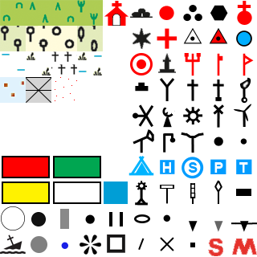
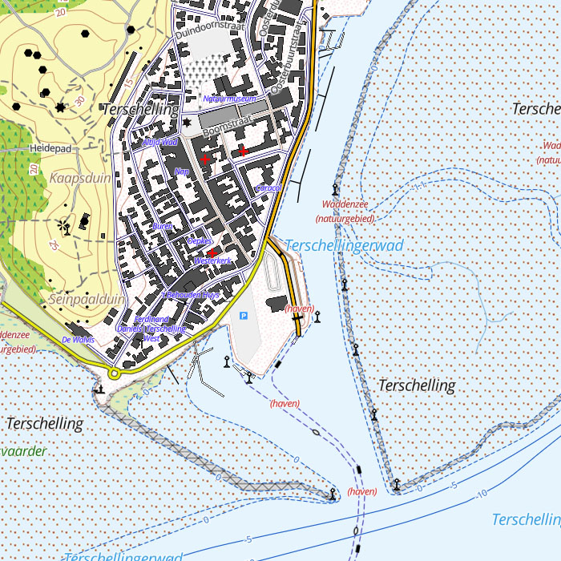
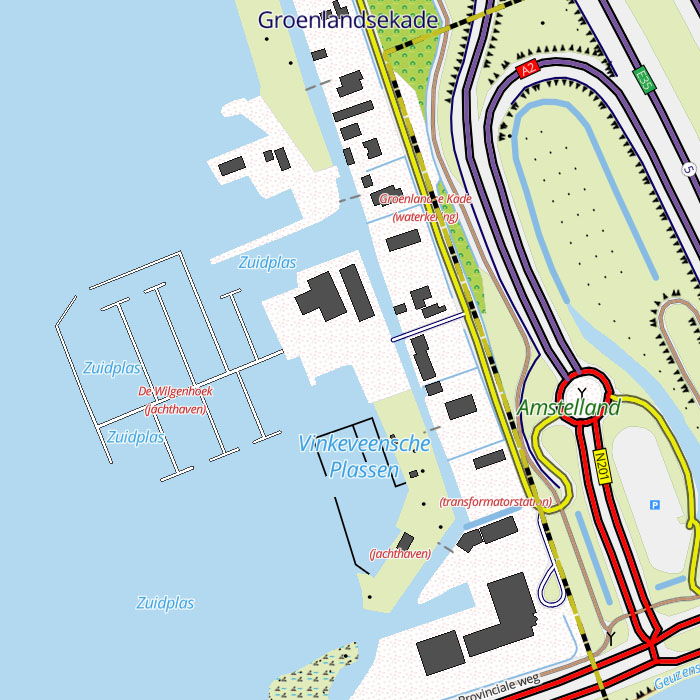
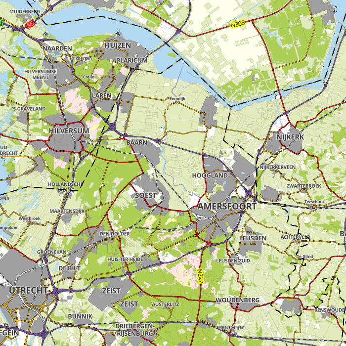
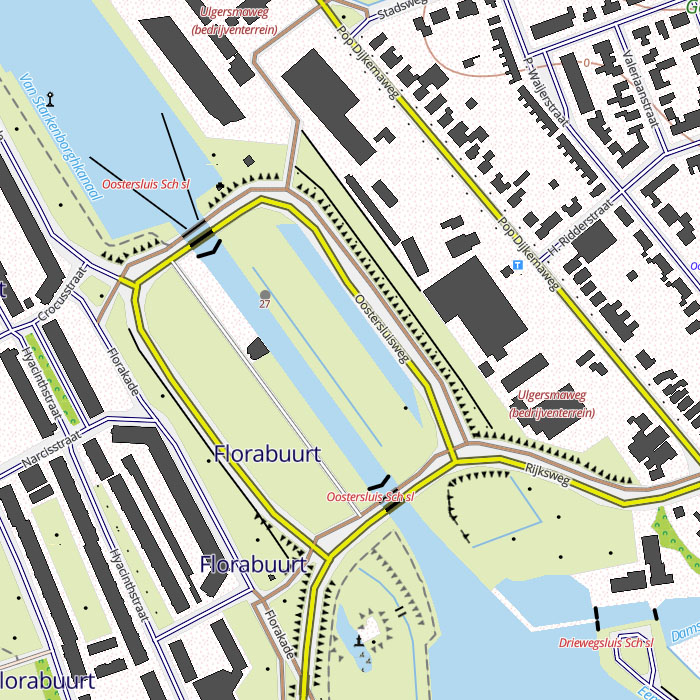
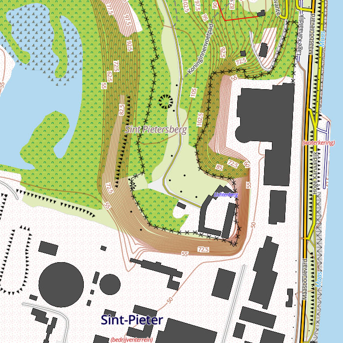
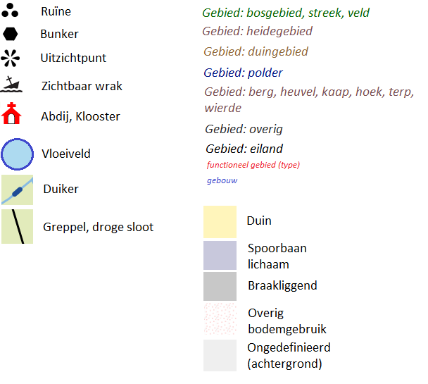

# The PDOK BRT TopNL Styling Project
## Introduction
One of the challenges of serving PDOK BRT vector maps is to create a suitable styling. For this, we wanted to create a style that matches the PDOK BRT TopRaster maps as close as possible. We take this legend as point of starting. Note: the date is november 2016, but it is still enclosed in current (2024) PDOK releases.


Most of the visualisations could be implemented using MapBox styling, however a few items had to be modified. Refer to the [latest chapter](#Known-issues-and-deviations) for a list of deviations.

An advantage is that the vector maps contain more information than is shown in the raster maps, so we can add these as new features like bunkers and viewpoints. Another advantage of vector maps of course is that we can zoom in without the map becoming pixelated. 

> 📝The styling has been done based on the **februar and april release 2024** of PDOK TopNL. Of course it should work on other releases, however due to the first issue (the concatenation issue, see below) small differences occur between subsequent versions, resulting in not drawing all symbols.

## The PDOK TopNL geopackage explained
First a bit about the structure of the [PDOK TopNL geopackages](https://www.pdok.nl/introductie/-/article/basisregistratie-topografie-brt-topnl).

* The geopackages can be downloaded at the [PDOK ATOM Download Service](https://service.pdok.nl/brt/topnl/atom/index.xml), one package for each scale. The current release (there are 5 releases each year) can be downloaded, as well as the latest release of previous years. 
* A Geopackage (.gpkg file) is a database in [SQLite format](https://www.sqlite.org/). It can be opened with tooling like sqlite3.
* TopNL currently has a Geopackage for each scale: ```top10nl_Compleet.gpkg``` for scale 1:10.000 up to ```top1000nl_Compleet.gpkg``` for 1:1.000.000
* Each table in the database represents a **layer** containing **features**. Each row describes a **feature**, each column an **attribute**.
* Each table name in the package ends with '_punt_', '_lijn_', '_vlak_' or '_multivlak_', indicating the geometry of the features in that layer (POINT, LINE, POLYGON, MULTIPOLYGON). Each table name starts with 'top[scale]nl'. For example: 'top10nl_spoordeel_lijn' contains railway tracks at scale 1:10.000 of geometry LINE.
* Each table contains a number of columns: 
   * type indication (like 'typespoor' in 'top10nl_spoorbaan_deel' layer/table)
   * attributes (like 'aantalinwoners' or 'fysiekvoorkomen')
   * the actual geometry (POINT, LINE, etc)
* For some reason top10nl ommits underscores in column names, whereas they are used in higher scale packages. In top10nl the name is 'typespoor' whereas in the other files it is 'type_spoor'.
* In the [2021-11](2021-11.md) release all tables of top10nl contain all columns (all table definitions appear to be the same).
* For some reason some layers are missing in top50nl and top100nl: ```top[N]nl_geografisch_gebied_punt```, ```top[N]nl_geografisch_gebied_vlak```, ```top[N]nl_plaats_punt``` and ```top[N]nl_plaats_vlak```. These layers mainly contain names. Therefore for the zoomlevels corresponding to top10nl and top50nl we generate tiles based on top250nl (the scale for which the layers are present). 

Refer to next pages for a dump of tables, all possible distinct values of some key attributes and table definitions of the a number of TopNL releases:
* [2021-11](2021-11.md)
* [2022-11](2022-11.md)
* [2023-09](2023-09.md)
* [2024-02](2024-02.md)
* [2024-04](2024-04.md)

## Workflow
To facilitate work, following workflow was adopted:


Basically we worked from the Excel file ```layers.xslx```. Each row in the file represents a layer and how it is displayed. Using StyleConvert.java the lines were converted to JSON and inserted into a template, resulting in the style file ```style_topnl.json``` for Mapbox GL.

---

_A **layer** is an aggregation of **features**. Whereas a layer in the .gpkg contains various features regarding a specific subject and scale, a layer in the excel file and json file usually refers to one very specific feature type and how it is rendered on the map. The feature type is carefully filtered out a .gpkg layer based on scale, type and attributes_

---

The Excel file uses a number of Mapbox Style parameters (a subset, not all) which we can use to control the rendering. Each line corresponds with one layer. So it is easy to copy layers and adapt them.

The ```Check``` column defines a coordinate and zoomlevel (#[zoomlevel]/[lat]/[lon]) at which an example of the layer is shown. It can be used for testing by copying it in the Mapbox GL URL in the browser.

## Dynamic styling
For raster maps like TopNL Raster rendering is static: styling is done once for the most detailed zoomlevel and static images are generated. Zooming in means enlarging the image, zooming out means reducing the image. Zooming out enough means features can no longer be observed because they become to small to see.
Styling a vector map on the other hand is dynamic, which means features can be shown differently at different zoomlevels. Problems that arise here is that 'cluttering' can occur when zooming out. For this reason features should be omitted at less detailed zoomlevels.

Folling guidlines were applied:
* We use different scale TopNL maps for different zoomlevels: Top10NL, Top50NL, Top100NL, Top250NL, Top500NL and Top1000NL
* We ommit features when zooming out
* The order in which the layers appear in the Excel and JSON file defines the order of rendering: first layers are rendered first. So we start with the terrain, we end with labels

## Layers
The style file used by Mapbox GL is a JSON file that contains information about how a vector map is rendered. Refer to the [Mapbox Style Specification](https://docs.mapbox.com/style-spec/guides/) for details. Next shows our template file containing just one layer that draws the background color.

```
{
  "version": 8,
  "name": "PDOK BRT TopNL",
  "glyphs": "{fontstack}/{range}.pbf",
  "sources": 
  {
    "brt_topnl": 
    {
      "type": "vector",
      "url": "mbtiles://{PDOK BRT TopNL}"
    }
  },
  "sprite": "{styleJsonFolder}/sprites/sprites",
  "layers": 
  [
    {
      "id": "background",
      "type": "background",
      "paint": 
      {
        "background-color": "#000000"
      }
    }
  ]
}
```

The ```sources``` section defines the map data, ```glyphs``` the font files, ```sprite``` the graphical symbol location and layer the rules or ```layers``` defining the rendering of features.

\
**Sprites are all contained in two files: sprites.png and sprites@2x.png**

The layer definition is what defines the rendering of the map. An important rule is that layers are rendered in the order in which they are defined. Hence the order is the 'z order'. A layer later in the file will overlap a layer earlier in the file.

As described in the [readme](readme.md), we use various PDOK BRT TopNL maps at various zoomlevels. This means, for each map/zoomlevel selection we have to define a layer that controls the rendering of a particular feature. Subsequent maps use slightly different attribute names. For example the top10nl map uses no underscores in the the attribute names like ```typeweg``` whereas the other maps use underscores, like ```type_weg```. Attribute values can also differ. For example in top10nl we have for forrests ```typelandgebruik``` 'bos: loofbos', 'bos: naaldbos', 'bos: gemengd bos' and 'bos: griend', whereas in top250nl we only have ```type_landgebruik``` 'bos'.


## Examples
\
**Terschelling, zoomlevel 15**

\
**Vinkeveense plassen, zoomlevel 16**

\
**Amsterdam CS, zoomlevel 15**

\
**Amsterdam, zoomlevel 11**

\
**Mid NL, zoomlevel 10**

\
**Oostersluis Groningen, zoomlevel 16**

\
**Sint Pietersberg Maastricht, zoomlevel 16**

\
**De Peel, unused airport, zoomlevel 14**

## Known issues and deviations
### Extras
* Bunkers (```typeinrichtingselement``` 'bunker') are shown (as hexagon)
* Ruïnes (```typeinrichtingselement``` containing 'ruïne') are shown 
* Kloosters/Abdijen (```typegebouw``` containing 'klooster, abdij') are shown 
* Viewpoints (```typeinrichtingselement``` 'uitzichtpunt') are shown
* Wrecks (```typeinrichtingselement``` 'zichtbaar wrak') are shown
* ```typeinrichtingselement``` 'paalwerk' is shown as 'strekdam' but dashed, small dashes
* Water with ```functie``` 'vloeiveld' has a dark blue outline color, like 'waterzuivering' has a red outline color
* Roads and runways with ```status``` 'buiten gebruik' have a dashed red casing, long dashes ('in uitvoering' are black long dashes). For example airport De Peel 
* Also for the ```typeinrichtingselement``` 'kilometerpaal' (road) the value is shown, like for 'kilometerpaal spoorweg' and 'kilometerpaal water'
* When zooming in on ```typefunctioneelgebied``` 'Grafheuvel', it is shown as a circle
* A slight distinction is made between 'straat' (blue casing) and 'overige weg' (gray casing)
* On airports the 'startbaan' and 'rollerbaan' are drawn
* Names of ```geografisch gebied``` or simply 'gebied' is shown italic, like in the legend. However, it is not shown in black but slightly colored
  * 'bosgebied': greenish
  * 'heidegebied': dark pinkish
  * 'streek, veld': greenish
  * 'duingebied': brownish
  * 'polder': blueish
  * 'eiland': black
  * 'berg, heuvel', 'kaap, hoek', 'terp, wierde': brownish
  * 'overig': dark grey 
* Building names are small and blue
* When zooming in to zoomlevel 15, ```functioneel_gebied``` is shown in red, together with the type in braces, like 'Antillenstraat (bedrijventerrein)'. If no name is available, only the type is shown in braces.

\
**Differences and extras**

### Deviations
* We don't have roads with separate lanes on higher scales ('gescheiden rijbanen'). Zooming in to scale 1:10.000 shows lanes seperately.
* Culverts ('duikers') cannot be rendered, since MapBox does not allow symbol placement (>---<) at the end of a line. Therefore rendered as darkblue line geometry.
* ```typelandgebruik``` 'Overig' is white with red dots i.s.o. plain white
* ```typelandgebruik``` 'Spoorbaanlichaam' is grey i.s.o. white
* Roads in tunnels are drawn dashed, including the interior; on the legend only outline are dashed, no interior is drawn
* Aquaducts are shown conform the legend: however on TopRaster the road outlines are shown under the water as dashed lines, whereas in the legend they are not
* Duikers with ```fysiekvoorkomen``` 'in afsluitbare grondduiker' are shown with the text 'Sl Gd', whereas on TopRaster they are indicated with 'Gd'. No specifics in Legend.
* Buildings 'laagbouw' are dark grey instead of black, so black icons are still visible when the coincide with the building, which they often do
* Friese namen are not displayed, only officiele en nederlandse namen

### Issues
1. Some attributes like ```typegebouw``` can have more values that are concatenated in one string, like 'stationsgebouw|toren' or 'kasteel|toren'. Unfortunately in Mapbox you cannot filter on _parts of_ an attribute, like ```LIKE '%toren%'``` if you specifially look for 'toren'. Therefore if you want to filter, you have take into account _all occuring combinations_ of attribute values that incorporate the value you are looking for. Unfortunately, these combinations can change in subsequent versions of the PDOK TopNl map. This makes it hard to maintain.
**We solved this by introducing a new type of filter expression: "_IN" and "!_IN". During insertion of layers using StyleConvert the filter expression is evaluated and transalted to the expression used by MapBox GL (including all combinations). Refer to the [StyleConvert readme](./java/StyleConvert/readme.md).**
1. Only GPS kernnetpunt, not plain white RD points... (not found yet, not in the data, not on TopRaster)
1. ```typeinrichtingselement``` 'stuw' (small ones; points; grey rectangle) are not aligned to waterway, but are always drawn upright.
1. Issue: ```typeweg``` 'hoofdweg' on ```fysiekvoorkomen```'op beweegbaar deel van brug' not drawn at #17/53.226297/6.612613 whereas it is shown on raster maps; unclear why
1. 'Land' (Country), 'Provincie' (Province) and 'Gemeente' (County) borders overlap. If all are drawn this messes things up. It does not appear to be possible to give a hierarchy or priority which to draw when they overlap. Therefore at zoom levels 1.00-7.99 'Land' borders are drawn, form 8.00-12.99 'Provincie' borders and from 13.00-21.99 'Gemeente' borders. However, borders of adjacent 'Provincies' and 'Gemeentes' still overlap.
1. Mapbox sometimes does not show features like texts and icons if they overlap other features (decluttering), although allow_overlap is set to TRUE. This usually shows as disappearing/reappearing featues when zooming. Note that some features show when at detailed zoomlevels.
1. City and area names and icons are often added to Polygon objects. This can result in the name or icon to appear multiple times.

### To do
* Tram: add small gray/black blocks (tramhaltes?)

