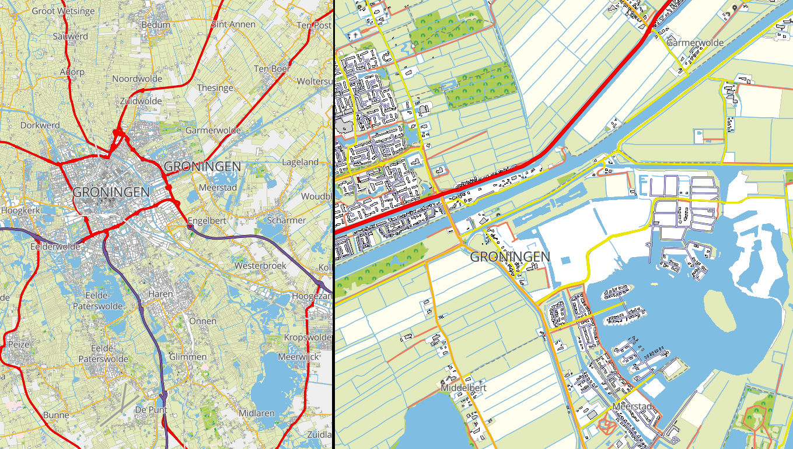
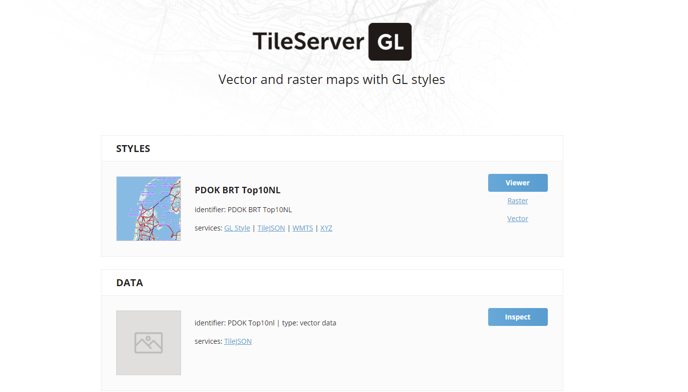

# PDOK TOP10 Tileserver Project
## Introduction
This project prepares the [PDOK TOP10NL topographic maps of the Netherlands](pdok.nl/downloads/-/article/basisregistratie-topografie-brt-topnl) for serving with the the [Tileserver GL](https://tileserver.org/) mapserver. Tileserver GL is an [open-source mapserver project on github](https://github.com/maptiler/tileserver-gl) and can be run as [docker container](https://hub.docker.com/r/maptiler/tileserver-gl). 

Refer to [my blog page](https://blog.studioblueplanet.net/?p=781) on this subject for more and detailed information.

This project offers
* scripts for converting the PDOK TOP10NL Geopackage into mbtiles
* scripts for getting the Tileserver GL up and running as docker container
* the configuration files for Tileserver GL
* style files for rendering the TOP10NL content as close as possible to the rasterized TOP25NL maps

The scripts use the [GDAL tools](https://gdal.org/).

This project does not offer
* the PDOK files; these must be downloaded from the [PDOK site](https://www.pdok.nl/downloads/-/article/basisregistratie-topografie-brt-topnl). We use the geopackage ATOM files.
* the converted mbtiles file itself
* the Tileserver GL software. We use it from the docker repo.
* The GDAL tools. These can be downloaded from [GisInternals](https://www.gisinternals.com/query.html?content=filelist&file=release-1911-x64-gdal-mapserver.zip). We use [gdal-303-1916-core.msi](https://download.gisinternals.com/sdk/downloads/release-1916-gdal-3-3-3-mapserver-7-6-4/gdal-303-1916-core.msi)


_Resulting map rendering_

The project assumes preparing the maps (mbtile files) on a Windows machine, while running Tileserver GL on a Linux machine.

## Prerequisite
### Disk
The processing is very data and disk intensive. Therefore performance is greatly enhanced when using a Solid State Disk (SSD) instead of a Hard Drive (HDD). The data size is tens of GByte, so a 250 GByte SDD suffices. 

### GDAL
[GDAL](https://download.gisinternals.com/sdk/downloads/release-1916-gdal-3-3-3-mapserver-7-6-4/gdal-303-1916-core.msi) must be installed. Run the gdal-303-1916-core.msi. This installs gdal in _/program files/GDAL_ (assuming 64 bit version). If you encounter error messages that **ogr_MSSQLSpatial.dll** cannot be loaded, just remove or rename this file in _/program files/GDAL/gdalplugins/_. We don't need it anyway.

## Converting PDOK maps
1. Download the geopackage PDOK TOP10 maps (top10nl.zip) on the [PDOK site](https://service.pdok.nl/brt/top10nl/atom/v1_0/index.xml) put them in the _/downloads_ directory
1. Extract the gpkg files to _/maps/gpkg_. Note that this requires about 10 GByte of space
1. Start a DOS cmd window
1. Enter the _/scripts_ directory
1. Run the script **01_merge_gpkg.bat**. This script merges a number of layers from the gpkg files into one file _/maps/merged_gpkg/merge.gpkg_ file. The operation takes about 10 minutes on an I7 processor with SSD
1. Run the script **02_convert_gpkg_to_mbtiles.bat**. This script convers the merged gpkg file into a mbtiles file _/maps/mbtiles/top10nl.mbtiles_. This operation takes about 13 hours on an I7 processor with SSD (for zoom levels 0-15). Logging is written to _/logs/log.txt_ (check this: no features should be ommited ommited features). The resulting mbtiles file is 3-5 GByte in size.

## Running Tileserver-GL
To run the tileserver proceed as follows, after generating the mbtiles map.
Note: run under Linux host with a Docker installation

1. Enter the _/tileserver_ directory 
2. Run the **start.sh** script
3. The tileserver will start, serving the _/maps/mbtiles/top10nl.mbtiles_ map. 

Expected output:
```
Starting tileserver-gl v3.1.1
Using specified config file from tileserver/config.json
Starting server
Listening at http://[::]:80/
Startup complete
mbgl: { class: 'Image',
  severity: 'WARNING',
  text: 'ImageReader (PNG): iCCP: known incorrect sRGB profile' }
...
```
Ignore the PNG warnings.

Use a browser to connect to port 8080 on the host. You are expected to see following:


_The tileserver-gl landing page_

Use Styles 'Viewer' to watch the rendered vector image using the style enclosed

Use Data 'Inspect' to watch the raw vector data.

## Known issues
* The tiles at large scale (low zoom levels) are huge in size resulting in slow rendering at low zoom levels. I guess the reason is they are derived from the top10nl maps, which contains a large number of features. You can limit the size of the tiles on conversion (MAX_SIZE parameter in ogr2ogr), but than random features are ommited from the tiles. This often results in improper rendering of the map at low zoom levels (missing parts of the sea, etc). I guess the best solution is to use larger scale maps (top50nl, top100nl, top250nl, top500nl, top1000nl) as source for the lower zoomlevels. A work around is to ommit the low zoomlevels from the mbtiles file resulting in no rendering at all. For the Netherlands it does not make sense to have zoom levels lower than 6.