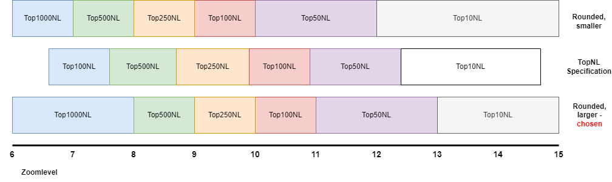

# PDOK BRT TOPNL Tileserver Project
## Introduction
PDOK (Publieke Dienstverlening op Kaart) is the Kadaster organisation in the Netherlands that provides topographic maps. One of their products publicly available is the Basisregistratie Topografie (BRT) TOPNL. PDOK provides these maps in various formats (raster as well as vector formats) on various scales. The scope of this project are the **vector maps** as provided in the dataset '[Basisregistratie Topografie (BRT) TOPNL](https://www.pdok.nl/introductie/-/article/basisregistratie-topografie-brt-topnl)'. 

Maps are provided in two vector formats (GML and GPKG) without styling.
**This project** prepares the PDOK [Basisregistratie Topografie (BRT) TOPNL](https://www.pdok.nl/downloads/-/article/basisregistratie-topografie-brt-topnl) GPKG for serving and rendering with the the [Tileserver GL](https://tileserver.org/) mapserver. Tileserver GL is an [open-source mapserver project on github](https://github.com/maptiler/tileserver-gl) and can be run as [docker container](https://hub.docker.com/r/maptiler/tileserver-gl). It is meant to serve vector and raster based maps in the MBTILES format.

Refer to [my blog page](https://blog.studioblueplanet.net/?p=781) on this subject for more and detailed information.

This project offers
* scripts for converting the PDOK TOPNL Geopackages into mbtiles. It uses various scales (top10nl, top50nl, top100nl, top250nl, top500nl and top1000nl) for the various zoomlevels
* scripts for getting the Tileserver GL up and running as docker container
* the configuration files for Tileserver GL
* style files for rendering the TOPNL content as close as possible to the rasterized [TOPraster maps](https://www.pdok.nl/introductie/-/article/dataset-basisregistratie-topografie-brt-topraster).
* a tool (in Java) that allows conversion of the JSON style file to CSV and back so that it can be edited in Excel (which makes it more easy than editing JSON)

The scripts use the excellent [GDAL tools](https://gdal.org/) (Geospatial Data Abstraction Library). This site contains a manual for the used functions. For merging mbtiles file we use [Mapbox Tippercanoe](https://github.com/mapbox/tippecanoe) or the better maintained [Felt Tippercanoe](https://github.com/felt/tippecanoe). Both tools are used as command-line tools.

This project does not offer
* the PDOK files; these must be downloaded from the [PDOK site](https://www.pdok.nl/downloads/-/article/basisregistratie-topografie-brt-topnl). We use the geopackage ATOM files.
* the converted mbtiles file itself
* the Tileserver GL software. We use it from the [docker repo](https://hub.docker.com/r/maptiler/tileserver-gl).
* The GDAL tools. These can be downloaded from [GisInternals](https://www.gisinternals.com/query.html?content=filelist&file=release-1911-x64-gdal-mapserver.zip). We use [gdal-303-1916-core.msi](https://download.gisinternals.com/sdk/downloads/release-1916-gdal-3-3-3-mapserver-7-6-4/gdal-303-1916-core.msi)
* The [Mapbox Tippercanoe](https://github.com/mapbox/tippecanoe) or [Felt Tippercanoe](https://github.com/felt/tippecanoe) tools. 


_Resulting map rendering_

Why this project? For my own projects I need maps reflecting the current situation as well as the situation a few years back, so I like to have a on-line collection of maps. 

## Prerequisite
### Windows and Linux
The project assumes preparing the maps (mbtile files) on a Windows machine, while running Tileserver GL on a Linux machine.
Preparation can be done on a Linux machine as well by the handy developer. GDAL is available in docker containers as well.

### GDAL
[GDAL](https://www.gisinternals.com/release.php) must be installed. Run the gdal-3.8.4-1930-x64-core.msi or comparable (I also worked with gdal-303-1916-core.msi). This installs gdal in _/program files/GDAL_ (assuming 64 bit version). If you encounter error messages that **ogr_MSSQLSpatial.dll** cannot be loaded, just remove or rename this file in _/program files/GDAL/gdalplugins/_. We don't need it anyway.

The handy develop can also use GDAL in a docker container on Linux. However, scripts have to be converted for this.

GDAL tools do not allow *updating/merging* of mbtiles file. This is possible for gpkg files though. Therefore we first merge at gkpg level and than convert to mbtiles.

### Mapbox/Felt Tippercanoe
This tool is available on github: [Mapbox Tippercanoe](https://github.com/mapbox/tippecanoe) or [Felt Tippercanoe](https://github.com/felt/tippecanoe). The latter appears better maintained, the former refers to the latter. Download and build under Linux. It requires the libsqlite3 libraries (libsqlite3-dev (Debian) or libsqlite3x-devel (Centos)). We only need _tile-join_ for merging the mbtiles files into one large mbtiles file.

### Docker
To run the TileServer GL using the scripts you need Docker on Linux.

### Disk
The processing is very data and disk intensive. Therefore 
 is greatly enhanced when using a Solid State Disk (SSD) instead of a Hard Drive (HDD). The data size is tens of GByte, so a 250 GByte SDD suffices. 

## Converting PDOK maps
### Detail levels, scale and zoom levels
MBTiles are generated for various zoomlevels (1-15). MBTiles tiles always have the same size in pixels (512x512). However, the smaller the zoomlevel, the larger geographical area is covered by one tile. While at first I used the most detailed top10nl for all zoom levels, this resulted in huge tile sizes at low zoomlevels/high scales.

PDOK however supplies the maps on various detail levels: top10nl (most detail), top50nl, top100nl, top250nl, top500nl, top1000nl (least detail). In the [service metadata](https://www.nationaalgeoregister.nl/geonetwork/srv/dut/catalog.search#/metadata/12fa3d3b-6ed6-4a7b-9231-fc0f856dc643) PDOK mentions the minimum and maximum scale for which the datasets can be used. The scales are shown in the table below.

The [Arcgis site 'Zoomlevels and Scale'](https://developers.arcgis.com/documentation/mapping-apis-and-services/reference/zoom-levels-and-scale/) presents a relation between zoomlevels and map scale. Mapbox Zoomlevel 0 (Arcgis zoomlevel 1) corresponds to 1:147,914,383. So the formula for deriving Mapbox zoomlevel from scale and v.v. is simply 

``` zoomlevel = ln( scale / 147,914,383 )/ln( 2 ) ```

``` scale =  147,914,383 / 2 ^ ( zoomlevel ) ```

In this way we find that zoomlevel 13.0 cooresponds to scale 1:18,056. I measured the scale of a map at zoomlevel 13.0 on a 25" monitor (HP 2510i) and found scale 1:19,925. So pretty good correspondence (+10%). Hence we use the formula to derive zoomlevels given the PDOK scales.

--- 
_The tooling requires _discrete_ zoomlevels, that is, a minimum and maximum zoomlevel. Tiles are created for discrete zoomlevels from the minimum zoomlevel to and including the maximum zoomlevel. So if we define minimum zoomlevel 3 and maximum zoomlevel 5, tiles are generated for zoomlevels 3, 4 and 5._

_In Mapbox GL tiles of a given zoomlevel are used from this zoomlevel up to the next zoomlevel (hence tiles for zoomlevel 3 are used from 3.000 to 3.999 if also tiles exists with zoomlevel 4). So when we have tiles for zoomlevels 3, 4 and 5 in the above example, they are used for 3.000 to 5.999._

_If no tiles exist for higher zoomlevels, Mapbox will use tiles with the highest zoomlevel. So in the example tiles with zoomlevel 5 are also used for zoomlevels 6.000 and higher, if no other tiles exist._

_Mapbox GL use the minimum zoomlevels as absolute limit: tiles are never used for zoomlevels smaller than the minimum zoomlevel. In our example, if we have tiles for 3, 4 and 5, if we show the map at zoomlevel 2.999, it disappears._

_So we have to round off the continuous min and max zoomlevel. We can choose to round down min and max (which means smaller scale tiles are used for lower zoomlevels; upper in next picture) or round up (which means larger scale tiles are used for higher zoomlevels; lower). The latter gives a better fit with the specification (middle)_



_Zoomlevels of subsequent scales should not overlap. If we have tiles at zoomlevel 7 for Top1000NL as well as Top500NL, it becomes unpredictable which tiles are going to be shown for zoomlevels 7.000-7.999._

---


| map | Scale min (PDOK) | Scale max (PDOK) | Minzoom | Maxzoom | Minzoom rounded | Maxzoom rounded | Used for zoomlevels |
|----|---|---|---|---|---|---|---|
| Top1000NL | 1:750.000 | 1:1.500.000 |  6.6 |  7.6 |  1 |  7 |  1.00-7.99
| Top500NL  | 1:350.000 |   1:750.000 |  7.6 |  8.7 |  8 |  8 |  8.00-8.99
| Top250NL  | 1:150.000 |   1:350.000 |  8.7 |  9.9 |  9 |  9 |  9.00-9.99
| Top100NL  |  1:75.000 |   1:150.000 |  9.9 | 10.9 | 10 | 10 | 10.00-10.99
| Top50NL   |  1:25.000 |    1:75.000 | 10.9 | 12.5 | 11 | 12 | 11.00-12.99
| Top10NL   |    1:5000 |    1:25.000 | 12.5 | 14.9 | 13 | 15 | 13.00-20.00

We map the various files on the zoomlevels to get tiles with roughly the same size in MBytes (0.5-1.5 MByte; done in _02_convert_merged_gpkg_to_mbtiles.bat_ and _03_convert_merged_gpkg_to_mbtiles.bat_):

Note
* MBTiles are generated at discrete zoomlevels. Tiles are rendered at continuous zoomlevels. Hence the zoomlevel 5 tiles are used for rendering levels 5.000-5.999.
* Tiles of zoom level 15 are used for rendering zoom levels 15-20, giving pretty good results. 
* With decreasing detail level features are ommited in the TopNL files of course. However, layer and feature names are not the same in each. This complicates the styling: For each map detail level separate styling rules have to be defined.
* On the first tries only the top10nl maps were used. This resulted in extremely large tiles sizes (in MByte) at low zoom levels and corresponding slow rendering speeds. A work around is to let GDAL shrink the tiles by ommitting features, however this resulted in badly rendered tiles (with holes and gaps) since features are ommitted randomly.
* It is easy to define your own mapping between detail level and zoom level by adjusting the MINZOOM and MAXZOOM parameters in _02_convert_gpkg_to_mtiles.bat_. The style file defines style layers for each detail level, so styling is not needed to adjust.
* The **city names** layers (plaats_punt and plaats_vlak) are missing in top50nl and top100nl. However, we would need to show the city names at corresponding zoom levels. Therefore, the city names from top250nl are used for the zoom levels 7-12 by using a work-around.

### The conversion
1. Download the geopackages TOP10NL, TOP50NL, TOP100NL, TOP250NL, TOP500NL and TOP1000NL maps  on the [PDOK site](https://www.pdok.nl/downloads/-/article/basisregistratie-topografie-brt-topnl) and put them in the _/maps/gpkg_ directory. Note that this requires about 15 GByte of space (Top10NL: 10 GByte, Top50NL: 3 GByte, Top100NL: 1 GByte, ...).
The files are named: _top[N]nl_Compleet.gpkg_ (Note: previously the layers of the TOP10 and Top50 were split up over multiple files, reducing the file size of the individual files; apparently now they are also served for each level as a 'Compleet' file)
1. Start a DOS cmd window
1. Enter the _/scripts_ directory
1. Run the script **01_merge_gpkg.bat**. This script merges a selected number of layers from the gpkg files into a file for each detail level in _/maps/merged_gpkg/_, for example _/maps/merged_gpkg/merge0010.gpkg_ for top10nl. These scripts filter the most relevant information while omitting the information that is not used, resulting in a size reduction of 34%. The operation takes about 6.5 minutes on an I7 processor with SSD
1. Run the script **02_convert_merged_gpkg_to_mbtiles.bat**. This script converts the merged gpkg files into a mbtiles file _/maps/mbtiles/_. For each scale an mbtiles file is generated: _top0010nl.mbtiles_ ... _top01000nl.mbtiles_. This operation takes about 3.5 hours on an I7 processor with SSD. Logging is written to _/logs/_ in separate log files (check the log files. No 'Recoding tile' warnings should be present. Apparently this is done when the maximum tile size is exceeded and it results in ommiting features). 
1. Run on Linux the script **04_merge_mbtiles.sh**. This merges the mbtiles into one file: _/maps/mbtiles/topnl.mbtiles_ (2.3 GByte). Not only all tiles are copied, also the metadata is merged. This command must be run on a Linux machine and requires Tippecanoe. Takes a few minutes at most.

---
Instead of running scripts 01 and 02 you can choose to run **03_convert_original_gpkg_to_mbtiles.bat**. This script parses the gpkg directories and converts _all_ TopNL information (layers, features) to a corresponding mbtiles file, without the filtering. After running the **04_merge_mbtiles.sh** script you end up with a topnl.mbtiles file that is 3.5 GByte in size, but that contains all TopNL features and attributes. Takes about 4 hours on the I7 with SSD. It writes the GDAL logging to the _/logs_ directory (showing layers, features and queries)

---

## Style
The style can be found in _/tileserver/styles/pdok_. The main file is _style_topnl.json_. The main component is the layers component, containing a layer for each feature (200-300) layers. In order to facilitate editing the layers can be exported to and from CSV using the StyleConvert tool. This enables editing in MS Excel, where each layer is one row (allowing for copying, etc). See the [readme](java/StyleConvert/readme.md). See the document about the [PDOK BRT TopNl Styling Project](ThePdokStylingProject.md) for details about the styling.

## Running Mapbox Tileserver-GL
### Containers
Though you can build TileServer GL from the [source code](https://github.com/maptiler/tileserver-gl), it is also available as [Docker Container](https://hub.docker.com/r/maptiler/tileserver-gl). The scripts provided are starting the server from a container. Of course, this requires Docker. 

### Run
To run the tileserver proceed as follows, after generating the mbtiles map.
Note: run under Linux host with a Docker installation

1. Enter the _/tileserver_ directory 
2. Run the **start.sh** script
3. The tileserver will start, serving the _/maps/mbtiles/top10nl.mbtiles_ map. 

Expected output:
```
Starting tileserver-gl v3.1.1
Using specified config file from tileserver/config.json
Starting server
Listening at http://[::]:80/
Startup complete
```
Use a browser to connect to port 8080 on the host. Use http, not https (you need a reverse proxy for https). You are expected to see following:


_The tileserver-gl landing page_

Use Styles 'Viewer' to watch the rendered vector image using the style enclosed

Use Data 'Inspect' to watch the raw vector data.

---
The file _/tileserver/config.json_ defines the maps that are showns and the styles that are used.

The directory _/tileserver/pdok/_ contains the style definition for the PDOK files. 

Note: it has been tested using v3.1.1 and v4.10.3.

---

### Data and Styles
TileServer GL uses the config.json to define **data** and **styles**. A **data source** defines the map data, like the mbtiles file we created. A **style** defines how the map data is rendered. The style itself is defined in a seperate JSON, in our case ```/style/pdok/topnl_style.json```. This style json file refers to the **data** defined in config.json:


## Versions

### v3.0 04-2024
* The software assumes that .gpkg files for all scales are delived as a single file _top[N]nl_Compleet.gpkg_ ([N] is 10, 50, 100, 250, 500, 1000).
* Style update - ongoing...

### v2.0 01-2022
The version is used for PDOK gpkg files in which the layers for the lower scales (10, 50) are distributed over multiple .gpkg files
* Added higher scale (250, 500, 100)
* Improved scripting
* Bugs

### v1.0 01-2022
Initial Version

## Known issues
* top50nl_terrein seems to contain a few invalid geometries
* I use tileserver 3.1.1. I haven't got the latest version working; working on it...
* The 04 script gives warnings like ``` Warning: mismatched maxzooms: 6 in ../maps/mbtiles/top500nl_Compleet.mbtiles vs previous 4 ```. Have to sort this out. It doesn't seem to affect the end result.

## Commenting
Leave comments on [github](https://github.com/scubajorgen/pdok_topnl_server/issues) if you have comments or questions.

## License
This software is published under the MIT license:

Copyright (c) 2024 Jörgen

Permission is hereby granted, free of charge, to any person obtaining a copy
of this software and associated documentation files (the "Software"), to deal
in the Software without restriction, including without limitation the rights
to use, copy, modify, merge, publish, distribute, sublicense, and/or sell
copies of the Software, and to permit persons to whom the Software is
furnished to do so, subject to the following conditions:

The above copyright notice and this permission notice shall be included in all
copies or substantial portions of the Software.

THE SOFTWARE IS PROVIDED "AS IS", WITHOUT WARRANTY OF ANY KIND, EXPRESS OR
IMPLIED, INCLUDING BUT NOT LIMITED TO THE WARRANTIES OF MERCHANTABILITY,
FITNESS FOR A PARTICULAR PURPOSE AND NONINFRINGEMENT. IN NO EVENT SHALL THE
AUTHORS OR COPYRIGHT HOLDERS BE LIABLE FOR ANY CLAIM, DAMAGES OR OTHER
LIABILITY, WHETHER IN AN ACTION OF CONTRACT, TORT OR OTHERWISE, ARISING FROM,
OUT OF OR IN CONNECTION WITH THE SOFTWARE OR THE USE OR OTHER DEALINGS IN THE
SOFTWARE.


## Other links
* [Vector Tiles: BRT and BGT](https://github.com/PDOK/vectortiles-bgt-brt)
* [Serving your own PDOK maps](https://blog.studioblueplanet.net/?p=781)
* [TileServer GL](https://github.com/maptiler/tileserver-gl) on github
* [Mapbox GL javascript library](https://github.com/mapbox/mapbox-gl-js) on github
* [GDAL on docker](https://hub.docker.com/r/osgeo/gdal)
* [GDAL ogrinfo tool (map info)](https://gdal.org/programs/ogrinfo.html)
* [GDAL ogr2ogr tool (format conversion)](https://gdal.org/programs/ogr2ogr.html)
* [GDAL Mapbox Vector Tiles format](https://gdal.org/drivers/vector/mvt.html#vector-mvt)
* [Map Style specification](https://docs.mapbox.com/mapbox-gl-js/style-spec/) 